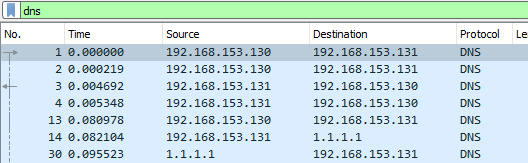
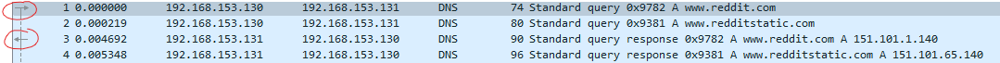
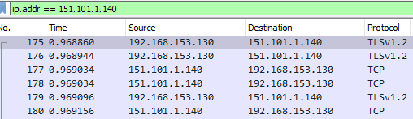
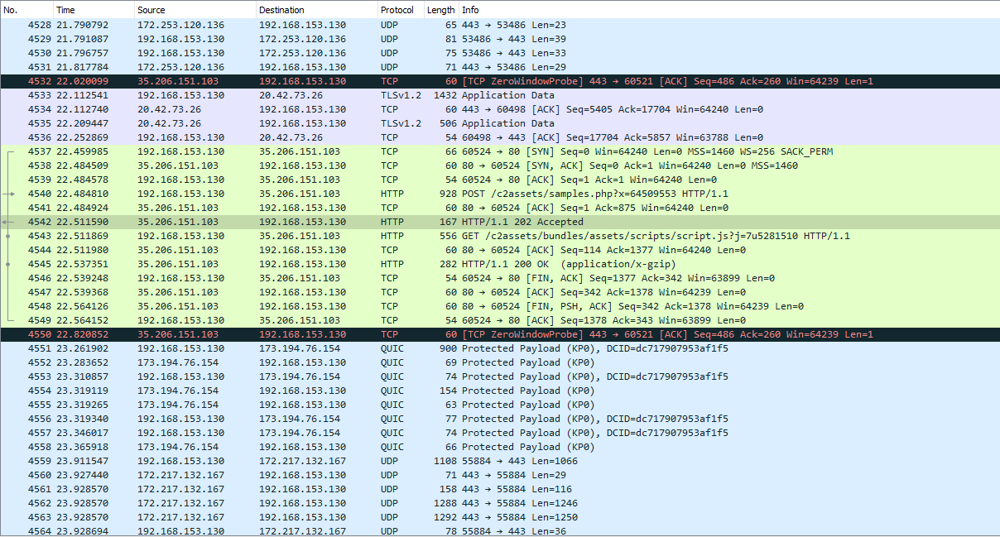
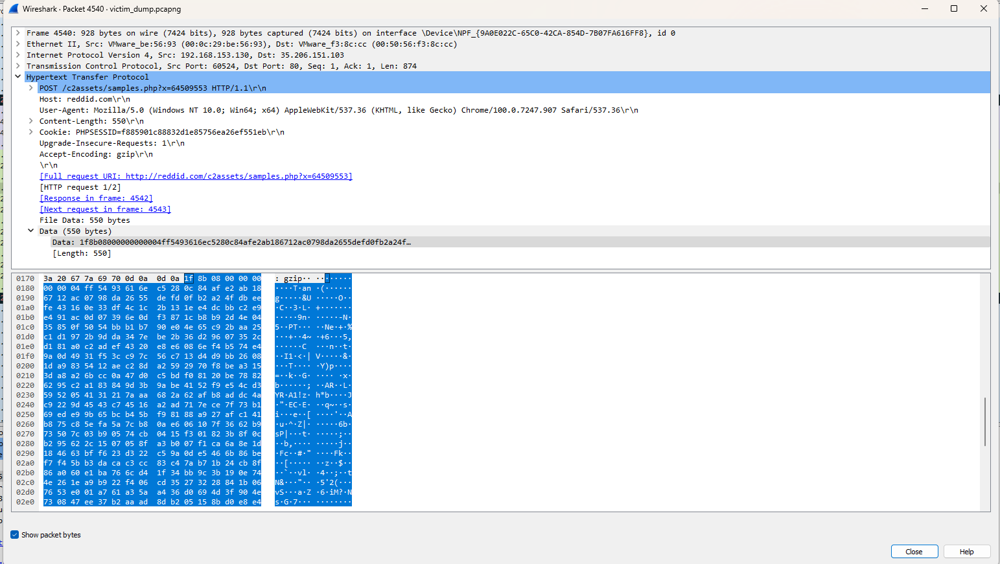
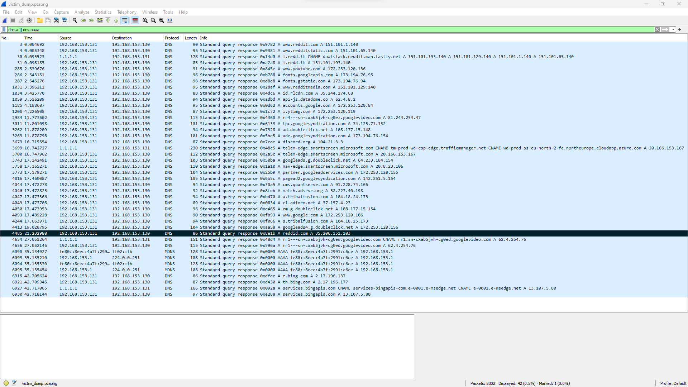
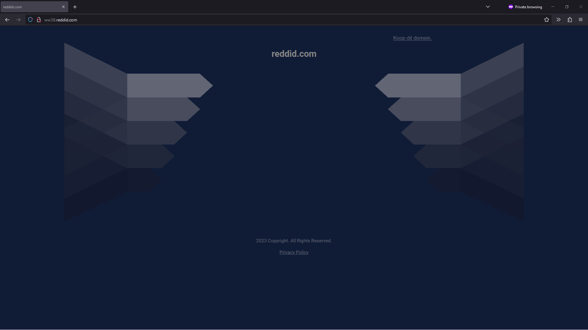
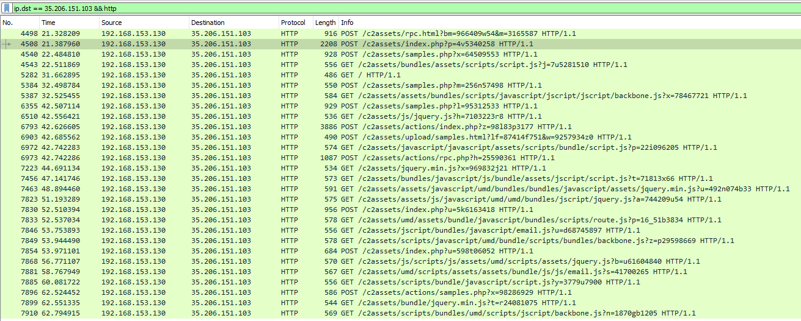

# Solution
In this challenge you were given a PCAP file of someone's hacked computer. The goal was to identify the server that the hacker uses to send instructions to the malware, called a C2 (Command and Control) server.

## What is a PCAP file?
A PCAP file stores a log of network traffic. The file can be opened with [Wireshark](https://www.wireshark.org). Of course it can also capture traffic. A cli application that allows capturing PCAP files is `tcpdump`.

Wireshark is your best friend for any networking related debugging/analysis! One of its easiest but also strongest features is the filter. For example, filtering the network dump for only DNS traffic can be done as follows: 

## What to look for?
Some might say that this comes with experience. However, only the speed at which one goes through a network dump will improve with experience. The most important part is knowing what each protocol does. If you know know the level that a protocol works at, what it delivers, and its flow, you'll know what to skim over and what to look out for. Here some examples.

### DNS (Domain Name System)
Resolves, i.e. translates, a hostname such as `google.com` to an IP address. DNS is (still) mainly unencrypted traffic. That means you can see which hosts the computer has asked to resolve. *This gives initial leads to what servers the computer talked with.* The related network traffic can be determined by matching the IP address.

Here we see 2 DNS requests with their respective answers. The arrows marked in red indicate the direction of the traffic (request/response). 

The response says that `www.reddit.com` can be found at IP address `151.101.1.140`. So to see all traffic that went from/to Reddit, we can use the filter `ip.addr == 151.101.1.140` 

Notice in above screenshot that either the `Source` or `Destination` column is the Reddit IP. The other must be our host's IP.

### HTTPS (TLS & TCP)
HTTP is the web protocol. It carries requests for websites and responses containing the data to be shown in a browser. However, the "S" in HTTP**S** stands for "Secure". This means that the data will be encrypted and unreadable. This is good because bad guys can't just capture network traffic and read what we're doing. Of course, it also means our analysis will be hard/impossible. *You can mostly skip this during analysis.*

HTTPS traffic can be identified by TLS packets/traffic followed by TCP traffic. TLS is the encryption part and the traffic is used to negotiate with the server how to encrypt everything. TCP is a higher level protocol that basically only tells us that "there is a 2-way consistent connection with data going over it". The reason why Wireshark doesn't show HTTPS packets should be clear. Because it is encrypted, Wireshark only sees random data. Thus, the best it can do is say that it is going over TCP.

### HTTP
The unencrypted variant. By now you'll understand that we can read what is being sent to/received from a website when reading this data. But so can bad guys, which is why it shouldn't be used anymore. *However, if present, it can be interesting to look at for analysis.*

## Identifying the C2 traffic & server
With the info about protocols, following screenshot should raise some eyebrows. Why is there HTTP traffic here? 

Let's look at one of the requests. The victim POSTed some data to the website at path `/c2assets/samples.php`. The extension `.php` indicates that PHP is used, a popular web language. This must be legit, right? 

But looking closer, several things feel off:
1. The host (name of the website) is `reddid.com`. This host is very similar to the popular page `reddit.com`.
2. The data that is sent to the server (marked in blue) is just random bytes. The data is being sent over the unencrypted HTTP so this should be readable.
3. The endpoint that data is sent to is `/c2assets/samples.php`. Data is usually sent when e.g. filling out a form or uploading a file. Why would a website display a form on a page called `samples` in the `assets` folder?

This must be the malicious traffic!

### What if there were more HTTP?
Within a company, it is normal to use a [TLS proxy](https://en.wikipedia.org/wiki/TLS_termination_proxy). Forcing employees to trust the company's self-made CA (Certificate Authority) and the self-signed certificates allows the company to intercept all TLS traffic. A proxy server can then decrypt the secured internet traffic, log it, and re-encrypt it before sending it to the actual destination server. With this setup, a company can log practically all HTTPS traffic as plain, readable HTTP.
So in a see of HTTP data, how would one determine this traffic to be likely malicious? After all, by using normal looking web server paths, it's trying to disguise as normal web traffic. Actually we'd use the same approach as described above: **look for inconsistencies**.
For this challenge, an alternative path would have been to filter on only DNS queries. Then, looking at all resolved domains.
Following screenshot shows all DNS A (IPv4) and AAAA (IPv6) answers. The query is `dns.a || dns.aaaa`. The list is quite short. Looking at the marked entry, we identify a domain with unusual name: `reddid.com`. The attacker seems to have re-used their [typosquatting](https://en.wikipedia.org/wiki/Typosquatting) domain name. 
The DNS entry contains the C2 server's IP address. Analysis can continue based on this.

## Getting the flag
Hackers know that it is impossible to prevent their traffic from being seen. This is why they employ clever tricks to obstruct analysis.

For example, when browsing to `reddid.com` the website returned is the following. This is a placeholder page of the company that sells this domain. The hacker already rotated hosts to prevent being caught! 

We can also try browsing directly to the IP address of the server  (`http://35.206.151.103`). However, this redirects us to the legitimate Reddit website. The hacker configured their server to do this using a **redirector**. This is an application in front of the C2 server that protects it from being exposed. The redirector expects a very specific combination of attributes in the request before it decides to pass it on to the C2 server. Otherwise, it simply misdirects anyone nosing around.

Luckily for us, the redirector is not configured enough. The filter it uses is too simple. We can discover what it checks for by looking for similarities between various HTTP requests to the server, in Wireshark. Filtering for only HTTP traffic sent to the server IP can be done with `ip.dst == 35.206.151.103 && http`. 

Notice how the path of the page, in the "Info" column, always starts with `/c2assets/` (we tried to give a hint here by making it "**c2**assets" instead of only "assets"). This is what the redirector checks for. Combining this with the info of the description that we should look for the `flag.txt` file leads us to checking `http://35.206.151.103/c2assets/flag.txt`, which returns the flag!
A real redirector would check multiple parameters, such as source IP, user agent, specific HTTP headers, etc.