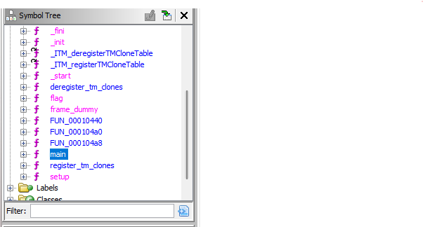
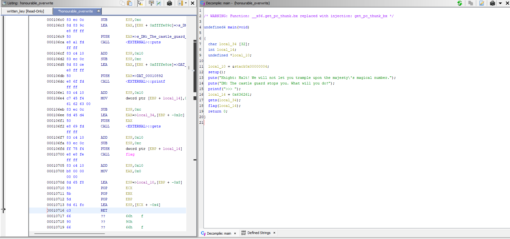
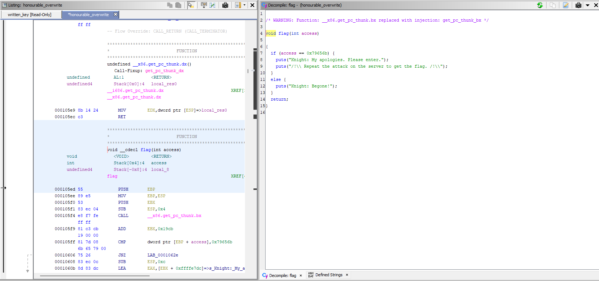
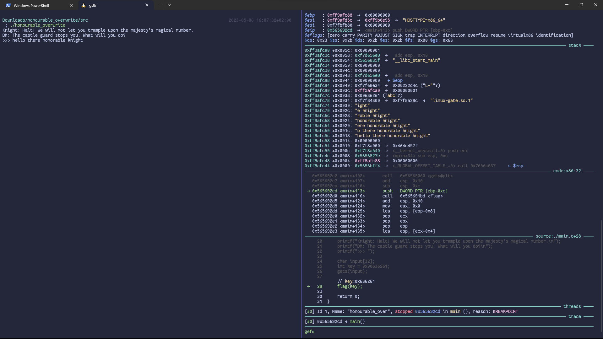
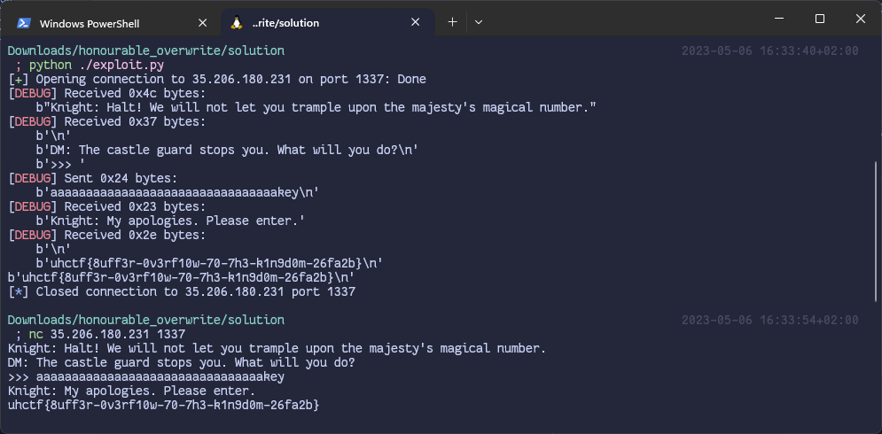

# Solution
## Analysing the binary
We can first open de binary in [Ghidra](https://github.com/NationalSecurityAgency/ghidra). In the `Symbol tree` pane, we select the main function. 

The assembly code and an attempt to reconstruct the C code are shown on the main panes now. 

Reading the decompiled C code, we can make up what the program is doing:
1. perform some kind of setup
2. print filler text
3. get user input
4. enter the `flag` function

We open this `flag` function in Ghidra. 

This function simply checks whether the provided parameter (`access`) matches some value (`0x79656b`). If it does, we will get the flag.

We go back to the main function to see what value is passed to the `access` parameter. Unfortunately, this value is hardcoded to something else (`0x636261`)!

It is possible to patch the binary. Replacing the bytes that make up the hardcoded value with the wanted value, and then running the application, will give us access. But there is no flag in our local copy! The flag will only be given by the copy running on the server. We need to somehow edit the parameter but not the binary itself. Our only option is looking at our input to the application.

The given binary contains a buffer overflow vulnerability. In the `main` function, the user's input is read with `gets` from stdin. `gets` is very unsafe as it reads data until it encounters a `\n`, or EOF. However, the buffer that stores the input is only 32 bytes big. Thus, any input longer than 32 bytes, including the newline, will *overflow* the buffer.

## Testing buffer overflow
We want to see what the application is doing while it's running. This can be done with a debugger. Run the local binary with `gdb`. Optionally, install [`gef`](https://github.com/hugsy/gef) for a better overview of the state of the application and useful commands. 

The input buffer is stored on the stack. We can see our input in the respective pane. We can also see the hardcoded value `0x636261`, which apparently matches the string `abc`, on the stack.

Note, the stack is called "the stack" because, within 1 function, you "stack" memory onto each other. Notice how our input starts at the bottom and ends higher up. Remember the Ghidra code. The string is only given 32 bytes of space. Now what would happen if the string kept going? We could overwrite the `access` parameter passed to the `flag` function with the value that it expects!

The expected value `0x79656b` also happens to be a string, nl. `key`. However, this is only to make the challenge easier. It could be any random bytes. With some code it is also possible to send these bytes.

All that is left is to connect to the server on the given port and send the payload. 